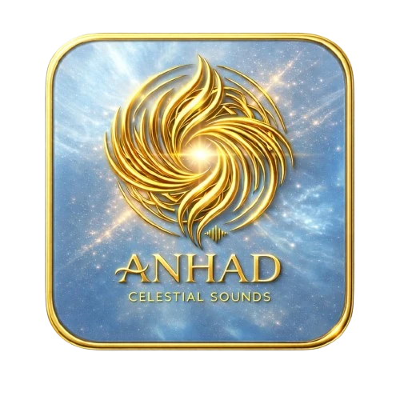

# 🎨 Complete Logo Replacement Guide for ANHAD

## Overview

This guide will help you replace all app logos throughout the ANHAD application with the new logo (`newlogo-removebg-preview.png`).

## 📦 What's Included

### Scripts
1. `generate-logos-simple.py` - Python script to generate all logo sizes
2. `GENERATE_LOGOS.bat` - Windows batch file for easy execution
3. `verify-logos.py` - Verification script to check all logos were created

### Documentation
1. `LOGO_GENERATION_README.md` - Detailed generation guide
2. `LOGO_UPDATE_SUMMARY.md` - Summary of what gets updated
3. `RUN_ME_TO_UPDATE_LOGOS.txt` - Quick start instructions

## 🚀 Quick Start (3 Steps)

### Step 1: Generate Logos
```
Double-click: GENERATE_LOGOS.bat
```

This will:
- Check for Python and Pillow
- Generate 20+ logo files in various sizes
- Copy files to Android assets automatically
- Show progress for each file

### Step 2: Verify Generation
```
python verify-logos.py
```

This will check that all logos were created with correct dimensions.

### Step 3: Test
1. Clear browser cache (Ctrl+Shift+Delete)
2. Reload the app
3. Check favicon in browser tab
4. Test PWA installation
5. Verify install banner logo

## 📋 Complete File List

### Generated in `assets/`
```
favicon-16x16.png          (16×16)
favicon-32x32.png          (32×32)
apple-touch-icon.png       (180×180)
app-logo.png               (512×512)
app-logo.webp              (512×512)
app-logo-96.png            (96×96)
app-logo-128.png           (128×128)
app-logo-144.png           (144×144)
app-logo-384.png           (384×384)
pwa-icon-192.png           (192×192)
pwa-icon-512.png           (512×512)
pure-logo.png              (512×512)
pure-logo.webp             (512×512)
new.webp                   (512×512)
```

### Generated in `assets/icons/`
```
icon-72x72.png             (72×72)
icon-152x152.png           (152×152)
icon-192x192.png           (192×192)
icon-512x512.png           (512×512)
icon-1024x1024.png         (1024×1024)
```

### Generated in root
```
favicon.ico                (multi-size: 16, 32, 48)
```

## 🔍 Where Logos Are Used

### 1. Browser & PWA
- **Favicon**: Browser tabs, bookmarks
- **Apple Touch Icon**: iOS home screen when added
- **PWA Icons**: Installed app icon on mobile/desktop
- **Manifest Icons**: App drawer, task switcher

### 2. Application UI
- **Header Logo**: Main navigation (currently uses nishan-logo.webp)
- **Install Button**: Bottom install app button
- **Install Banner**: Smart app banner
- **Splash Screens**: Loading states

### 3. Android App
All logos are automatically copied to:
```
android/app/src/main/assets/public/assets/
android/app/src/main/assets/public/assets/icons/
```

## 📝 Files That Reference Logos

### HTML Files
- `index.html` - Main page
- `manifest.json` - PWA configuration
- All subpages (Nitnem, Hukamnama, etc.)

### Key References in index.html
```html
Line 19: <link rel="apple-touch-icon" href="assets/apple-touch-icon.png">
Line 20: <link rel="icon" type="image/png" href="favicon.ico">
Line 21: <link rel="icon" sizes="32x32" href="assets/favicon-32x32.png">
Line 520: 
Line 555: 
```

### manifest.json
```json
{
  "icons": [
    { "src": "assets/icons/icon-72x72.png", "sizes": "72x72" },
    { "src": "assets/app-logo.png", "sizes": "96x96" },
    { "src": "assets/app-logo.png", "sizes": "128x128" },
    { "src": "assets/app-logo.png", "sizes": "144x144" },
    { "src": "assets/icons/icon-192x192.png", "sizes": "192x192" },
    { "src": "assets/app-logo.png", "sizes": "384x384" },
    { "src": "assets/icons/icon-512x512.png", "sizes": "512x512" }
  ]
}
```

## ⚙️ Technical Details

### Image Processing
- **Resampling**: LANCZOS (highest quality)
- **Format**: PNG (lossless) and WebP (compressed)
- **Transparency**: Preserved from original
- **Optimization**: PNG optimization enabled

### Requirements
- Python 3.6+
- Pillow library (PIL)
- Original logo with transparent background

### Installation
```bash
# Install Python from python.org
# Then install Pillow:
pip install Pillow
```

## 🔧 Troubleshooting

### Python not found
1. Download from https://www.python.org/downloads/
2. During installation, check "Add Python to PATH"
3. Restart Command Prompt

### Pillow installation fails
```bash
pip install --upgrade pip
pip install Pillow
```

### Logo looks blurry
- Ensure source logo is high resolution (512×512 minimum)
- Check that transparency is preserved
- Verify LANCZOS resampling is used

### Android assets not copied
- Check that Android directory exists
- Verify path: `../android/app/src/main/assets/public/assets/`
- Run script from `frontend/` directory

## 📱 Testing Checklist

### Desktop Browser
- [ ] Favicon appears in browser tab
- [ ] Favicon appears in bookmarks
- [ ] Install banner shows correct logo
- [ ] Install button shows correct logo

### PWA Installation
- [ ] Install app from browser
- [ ] Check app icon in start menu/dock
- [ ] Verify splash screen logo
- [ ] Test app drawer icon

### Mobile Browser
- [ ] Add to home screen (iOS)
- [ ] Add to home screen (Android)
- [ ] Check home screen icon
- [ ] Verify splash screen

### Android App
- [ ] Rebuild app with new assets
- [ ] Check app icon
- [ ] Verify in-app logos
- [ ] Test on different screen densities

## 🎯 Next Steps After Generation

1. **Commit Changes**
   ```bash
   git add assets/ favicon.ico
   git commit -m "Update app logos to new design"
   ```

2. **Deploy to Web**
   - Upload new assets to server
   - Clear CDN cache if applicable
   - Test on production

3. **Update Android App**
   - Rebuild Android app
   - Test on devices
   - Submit update to Play Store

4. **Update iOS (if applicable)**
   - Update Capacitor assets
   - Rebuild iOS app
   - Submit to App Store

## 📞 Support

If you encounter issues:
1. Check `verify-logos.py` output
2. Review error messages in generation script
3. Ensure source logo is valid PNG with transparency
4. Verify Python and Pillow are installed correctly

## 🎉 Success!

Once complete, your app will have:
- ✅ Consistent branding across all platforms
- ✅ High-quality logos at all sizes
- ✅ Optimized file formats (PNG + WebP)
- ✅ Proper transparency preservation
- ✅ Android assets automatically synced

---

**Last Updated**: March 31, 2026
**Version**: 1.0
**Author**: ANHAD Development Team
